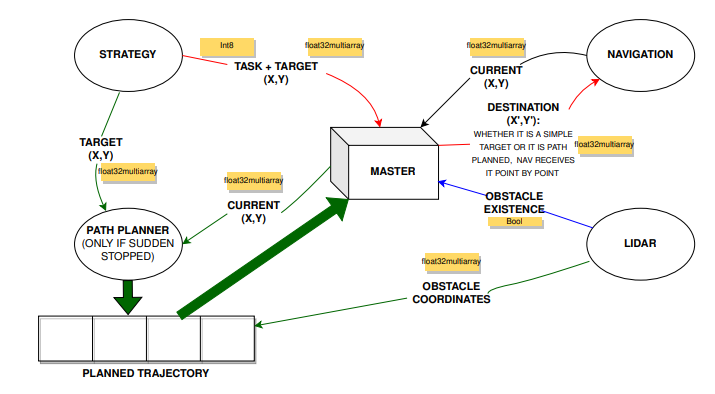
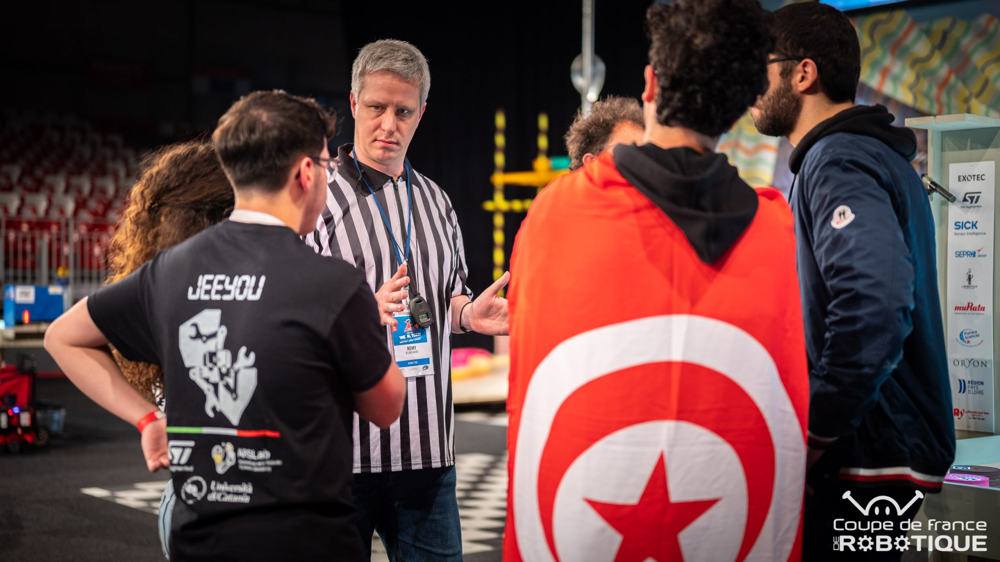

# Eurobot 2023 Robotics Competition 

## Overview
As a member of the Eurobot 2023 competition team, I contributed to the design, development, and deployment of an autonomous robot tailored to meet the competition's challenges. Representing the IEEE INSAT Robotics and Automation Society Chapter, we built the system from the ground up, focusing on robust hardware integration, efficient software development, and collaborative teamwork. This project encompassed areas such as sensor integration, path planning, state machine design, and system validation, resulting in a competitive robot capable of meeting real-time operational demands.

## My Contributions

### 1. Obstacle Detection System
- Selected the **YDLidar X2** as the primary sensor for obstacle detection.
- Extracted and processed useful data from the LiDAR to meet the robot's requirements.
- Implemented the **tf package** to manage relationships between coordinate frames effectively.

### 2. Finite State Machine (FSM) Development
- Developed a modular FSM using **ROS** and the **SMACH package** by Jonathan Bohren.
- Achieved seamless synchronization of various robot modules, including navigation, path planning, and obstacle detection.
### Architecture
  
*The image showcases the architecture of the robot system I developed, highlighting the interaction between modules.*

### 3. Key Achievements
- Learned ROS fundamentals and applied them to build a highly effective obstacle detection module.
- Constructed a robust state machine to ensure smooth operation and synchronization of robot systems.
- Enhanced my technical expertise in **ROS, C++, Python, LiDAR, Raspberry Pi, and Rviz**.

## Competition Highlights
- Represented our team at the international **Eurobot 2023** competition.
- Won 2 out of the 5 matches played
- Gained valuable insights by engaging with teams from around the world.
- Proudly received the **Mediation Prize** awarded by **Planète Sciences** for our innovative efforts.

Here is a video demonstration showcasing the robot's performance during a match (the robot starting at the far left) 

 

